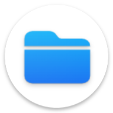
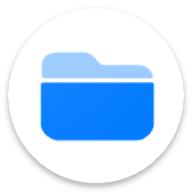

  

# Right Files/Alright Files
  

Alright Files is a clean, open-source file manager built for privacy. No ads. No trackers. No unnecessary permissions. Just fast, reliable file browsing with a fully customizable interface — switch themes, adjust layouts, and make it yours. Copy, move, rename, delete, and organize files with ease. Your data stays on your device, always.
  

## ☕ Support the Project

If you find **Right Files/Alright Files** useful and would like to support its development, consider
buying me a coffee! Your support helps me maintain and improve this project.

*Every contribution, no matter how small, helps keep this project alive and growing! ❤️*   

*Based on [Simple File Manager](https://github.com/SimpleMobileTools/Simple-File-Manager), [Fossify File Manager](https://github.com/FossifyOrg/File-Manager).*
